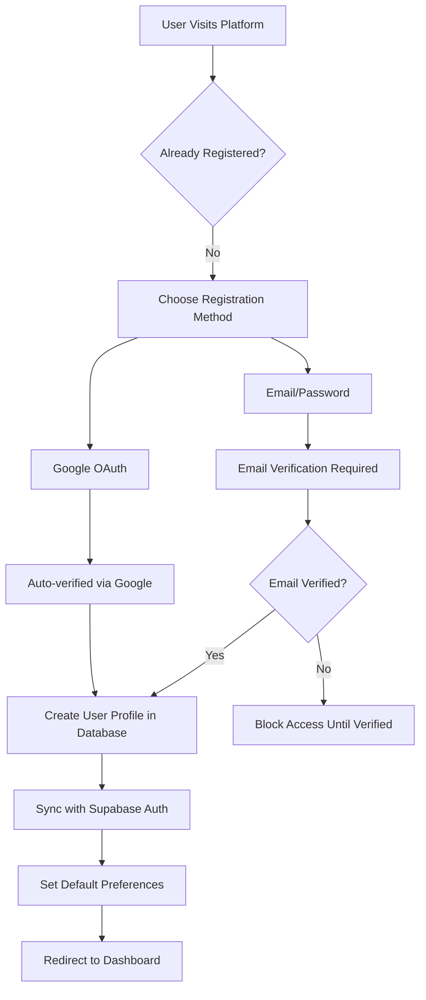
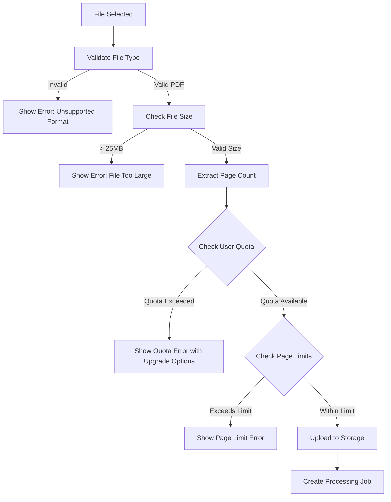
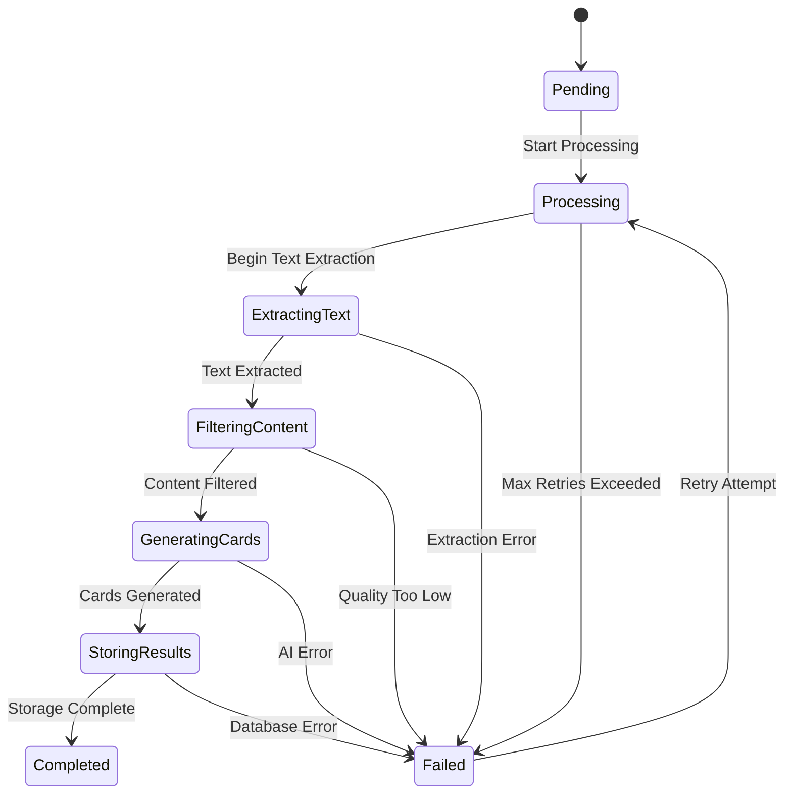
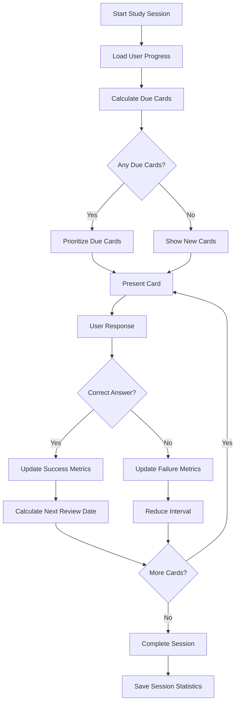
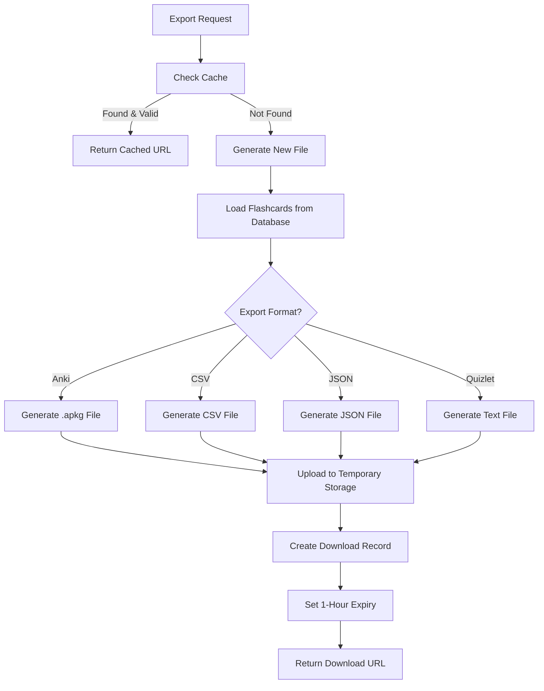
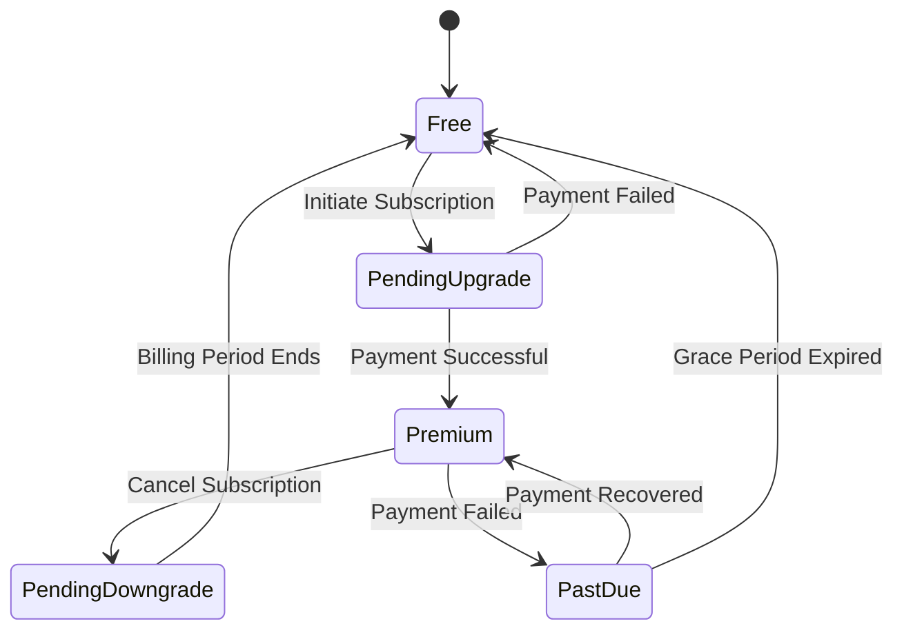
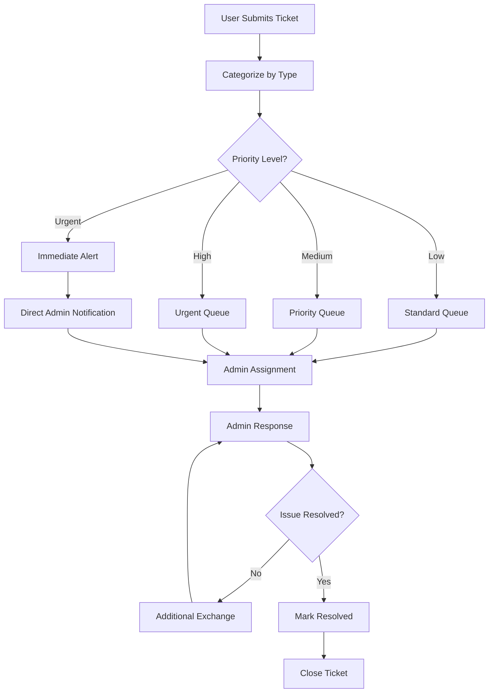

# StudyCards AI - Logic Flow Documentation

## Core Application Flows

This document maps out the key business logic flows, decision points, and data transformations throughout the StudyCards AI platform.

## 1. User Authentication & Authorization Flow

### Initial User Registration


### Session Management Logic
```typescript
// Authentication state machine
interface AuthState {
  user: User | null;
  loading: boolean;
  emailVerified: boolean;
  subscriptionStatus: 'free' | 'premium';
}

// Auth flow decision points
1. Token Validation: Check JWT expiry and signature
2. Email Verification: Required for email/password users
3. Profile Sync: Ensure database profile matches auth user
4. Subscription Check: Determine feature access level
5. Role Authorization: Admin/moderator access control
```

## 2. PDF Upload & Processing Pipeline

### Upload Validation Flow


### Content Processing Logic
```typescript
// Processing pipeline decision tree
async function processDocument(jobId: number) {
  // Step 1: Text Extraction Strategy
  const isScanned = await detectIfScanned(pdfPath);
  const extractionMethod = isScanned ? 'OCR' : 'Direct';
  
  // Step 2: Content Quality Assessment
  const textContent = await extractText(pdfPath, extractionMethod);
  const qualityScore = assessContentQuality(textContent);
  
  if (qualityScore < 0.3) {
    throw new Error('Document quality too low for processing');
  }
  
  // Step 3: Intelligent Preprocessing
  const relevantContent = filterRelevantContent(textContent, subject);
  const chunks = intelligentChunk(relevantContent, maxChunkSize);
  
  // Step 4: AI Generation with Fallback
  for (const chunk of chunks) {
    try {
      const flashcards = await generateFlashcards(chunk, config);
      await storeNormalizedFlashcards(jobId, flashcards);
    } catch (error) {
      await handleProcessingError(jobId, error);
    }
  }
}
```

### Processing State Machine


## 3. AI Model Selection & Processing Logic

### Model Selection Algorithm
```typescript
// AI model selection logic
function selectAIModel(userTier: string, requestedQuality: string) {
  const modelConfig = getModelConfiguration();
  
  // Enforce tier restrictions
  if (userTier === 'free' || requestedQuality === 'basic') {
    return modelConfig.basic; // Default: claude-3.5-sonnet
  }
  
  if (userTier === 'premium' && requestedQuality === 'advanced') {
    return modelConfig.advanced; // Default: gpt-4o
  }
  
  // Fallback to basic for invalid combinations
  return modelConfig.basic;
}

// Admin configurable model mapping
interface ModelConfiguration {
  basic: string;    // Free + Premium users
  advanced: string; // Premium users only
}
```

### Content Focus Area Logic
```typescript
// Focus area processing weights
interface FocusAreaWeights {
  concepts: number;     // 0.0 - 1.0 weight
  definitions: number;  // 0.0 - 1.0 weight
  examples: number;     // 0.0 - 1.0 weight
  procedures: number;   // 0.0 - 1.0 weight
}

// Prompt generation based on focus areas
function generateFocusedPrompt(text: string, areas: FocusAreaWeights) {
  let prompt = basePrompt;
  
  if (areas.concepts > 0.5) {
    prompt += "\nEmphasize conceptual understanding and relationships.";
  }
  if (areas.definitions > 0.5) {
    prompt += "\nFocus on key terms and their precise definitions.";
  }
  if (areas.examples > 0.5) {
    prompt += "\nInclude practical examples and applications.";
  }
  if (areas.procedures > 0.5) {
    prompt += "\nHighlight step-by-step processes and methods.";
  }
  
  return prompt;
}
```

## 4. Study Session Logic & Spaced Repetition

### Study Mode Algorithm


### Spaced Repetition Calculation
```typescript
// SM-2 inspired spaced repetition algorithm
interface CardProgress {
  status: 'new' | 'learning' | 'reviewing' | 'known';
  correctStreak: number;
  totalReviews: number;
  correctReviews: number;
  lastReviewedAt: Date;
  nextReviewDate: Date;
}

function calculateNextReview(progress: CardProgress, isCorrect: boolean): Date {
  const now = new Date();
  let intervalDays = 1; // Start with 1 day
  
  if (isCorrect) {
    progress.correctStreak++;
    
    // Progressive intervals based on streak
    switch (progress.correctStreak) {
      case 1: intervalDays = 1; break;      // 1 day
      case 2: intervalDays = 3; break;      // 3 days
      case 3: intervalDays = 7; break;      // 1 week
      case 4: intervalDays = 14; break;     // 2 weeks
      case 5: intervalDays = 30; break;     // 1 month
      default: intervalDays = 180; break;   // 6 months (max)
    }
    
    // Update status based on performance
    if (progress.correctStreak >= 3) {
      progress.status = 'known';
    } else if (progress.correctStreak >= 1) {
      progress.status = 'reviewing';
    }
  } else {
    // Reset streak on incorrect answer
    progress.correctStreak = 0;
    progress.status = progress.totalReviews === 0 ? 'new' : 'learning';
    intervalDays = 1; // Back to 1 day
  }
  
  const nextReview = new Date(now);
  nextReview.setDate(nextReview.getDate() + intervalDays);
  
  return nextReview;
}
```

### Batch Progress Update Logic
```typescript
// Optimized batch processing for study progress
class StudyProgressBatcher {
  private batchSize = 20;
  private batchTimeout = 3000; // 3 seconds
  private pendingUpdates: Map<string, StudyProgressUpdate> = new Map();
  private batchTimer: NodeJS.Timeout | null = null;
  
  async updateProgress(update: StudyProgressUpdate) {
    // Add to batch
    const key = `${update.userId}-${update.flashcardId}`;
    this.pendingUpdates.set(key, update);
    
    // Process if batch is full
    if (this.pendingUpdates.size >= this.batchSize) {
      await this.processBatch();
    } else {
      // Set timer for automatic processing
      if (!this.batchTimer) {
        this.batchTimer = setTimeout(() => this.processBatch(), this.batchTimeout);
      }
    }
  }
  
  private async processBatch() {
    if (this.pendingUpdates.size === 0) return;
    
    const updates = Array.from(this.pendingUpdates.values());
    this.pendingUpdates.clear();
    
    if (this.batchTimer) {
      clearTimeout(this.batchTimer);
      this.batchTimer = null;
    }
    
    // Execute concurrent database updates
    await Promise.all(
      updates.map(update => this.storage.upsertStudyProgress(update))
    );
  }
}
```

## 5. Export System Logic

### On-Demand File Generation Flow


### Export Format Logic
```typescript
// Format-specific generation logic
class ExportService {
  async generateExport(jobId: number, format: ExportFormat): Promise<string> {
    const flashcards = await this.storage.getFlashcards(jobId);
    
    switch (format) {
      case 'anki':
        return this.generateAnkiDeck(flashcards);
      case 'csv':
        return this.generateCSV(flashcards);
      case 'json':
        return this.generateJSON(flashcards);
      case 'quizlet':
        return this.generateQuizlet(flashcards);
      default:
        throw new Error(`Unsupported format: ${format}`);
    }
  }
  
  private generateCSV(flashcards: Flashcard[]): string {
    const headers = ['Front', 'Back', 'Subject', 'Difficulty', 'Tags'];
    const rows = flashcards.map(card => [
      this.escapeCsv(card.front),
      this.escapeCsv(card.back),
      card.subject || '',
      card.difficulty || '',
      (card.tags || []).join(';')
    ]);
    
    return [headers, ...rows]
      .map(row => row.map(cell => `"${cell}"`).join(','))
      .join('\n');
  }
}
```

## 6. Quota Management & Billing Logic

### Upload Quota Enforcement
```typescript
// Quota validation logic
async function validateUploadQuota(userId: string): Promise<QuotaValidation> {
  const userProfile = await getUserProfile(userId);
  const currentMonth = new Date().getMonth();
  const currentYear = new Date().getFullYear();
  
  // Check if quota needs reset (new month)
  const lastUpdate = new Date(userProfile.updatedAt);
  const needsReset = (
    lastUpdate.getMonth() !== currentMonth ||
    lastUpdate.getFullYear() !== currentYear
  );
  
  if (needsReset) {
    await resetMonthlyQuota(userId);
    userProfile.uploadsThisMonth = 0;
  }
  
  const quotaExceeded = userProfile.uploadsThisMonth >= userProfile.maxMonthlyUploads;
  
  return {
    canUpload: !quotaExceeded,
    uploadsRemaining: userProfile.maxMonthlyUploads - userProfile.uploadsThisMonth,
    needsUpgrade: quotaExceeded && !userProfile.isPremium,
    resetDate: getNextMonthDate()
  };
}
```

### Subscription State Machine


## 7. Admin Panel Logic & Configuration

### Model Configuration Flow
```typescript
// Admin model configuration system
interface ModelConfig {
  basic: string;    // Available to all users
  advanced: string; // Premium users only
}

async function updateModelConfiguration(
  adminUserId: string,
  newConfig: ModelConfig
): Promise<void> {
  // Validate admin permissions
  const admin = await getUserProfile(adminUserId);
  if (admin.role !== 'admin') {
    throw new Error('Insufficient permissions');
  }
  
  // Validate model availability
  await validateModelAvailability(newConfig.basic);
  await validateModelAvailability(newConfig.advanced);
  
  // Update configuration
  await updateAdminSetting('ai_model_basic', newConfig.basic);
  await updateAdminSetting('ai_model_advanced', newConfig.advanced);
  
  // Update in-memory cache
  modelMap.basic = newConfig.basic;
  modelMap.advanced = newConfig.advanced;
  
  // Log configuration change
  await logAdminAction(adminUserId, 'model_config_update', newConfig);
}
```

### Support Ticket Workflow


## 8. Error Handling & Recovery Logic

### Processing Error Recovery
```typescript
// Error categorization and recovery strategy
interface ProcessingError {
  type: 'temporary' | 'permanent' | 'user_fixable';
  retryable: boolean;
  userMessage: string;
  technicalDetails: string;
}

async function handleProcessingError(jobId: number, error: any): Promise<void> {
  const categorizedError = categorizeProcessingError(error);
  
  if (categorizedError.retryable && getRetryCount(jobId) < 3) {
    // Implement exponential backoff
    const delay = Math.pow(2, getRetryCount(jobId)) * 1000;
    setTimeout(() => retryProcessing(jobId), delay);
  } else {
    // Mark job as failed with user-friendly message
    await updateJobStatus(jobId, 'failed', categorizedError.userMessage);
    
    // Notify admin for permanent failures
    if (categorizedError.type === 'permanent') {
      await notifyAdminOfFailure(jobId, categorizedError);
    }
  }
}
```

### Data Integrity Safeguards
```typescript
// Transaction-based data operations
async function createFlashcardJobWithValidation(
  jobData: InsertFlashcardJob
): Promise<FlashcardJob> {
  return await db.transaction(async (tx) => {
    // Validate quota before creating job
    const canUpload = await validateUploadQuota(jobData.userId);
    if (!canUpload.canUpload) {
      throw new QuotaExceededError('Monthly upload limit reached');
    }
    
    // Create job record
    const job = await tx.insert(flashcardJobs).values(jobData).returning();
    
    // Increment user upload count
    await tx
      .update(userProfiles)
      .set({
        uploadsThisMonth: sql`uploads_this_month + 1`,
        updatedAt: new Date()
      })
      .where(eq(userProfiles.id, jobData.userId));
    
    return job[0];
  });
}
```

## 9. Performance Optimization Logic

### Caching Strategy
```typescript
// Multi-layer caching system
class CacheManager {
  private memoryCache = new Map<string, CachedContent>();
  private diskCache: string; // File system cache directory
  
  async getCachedFlashcards(
    contentHash: string,
    subject: string,
    difficulty: string
  ): Promise<FlashcardPair[] | null> {
    // Layer 1: Memory cache (fastest)
    const memoryKey = `${contentHash}-${subject}-${difficulty}`;
    if (this.memoryCache.has(memoryKey)) {
      return this.memoryCache.get(memoryKey)!.flashcards;
    }
    
    // Layer 2: Disk cache (fast)
    const diskResult = await this.loadFromDisk(memoryKey);
    if (diskResult) {
      // Promote to memory cache
      this.memoryCache.set(memoryKey, diskResult);
      return diskResult.flashcards;
    }
    
    // Cache miss - need to generate
    return null;
  }
  
  // Automatic cleanup based on usage and age
  private enforceMemoryLimits(): void {
    if (this.memoryCache.size > 200) {
      // Remove oldest entries
      const entries = Array.from(this.memoryCache.entries());
      entries.sort((a, b) => a[1].timestamp - b[1].timestamp);
      
      // Remove oldest 25% of entries
      const removeCount = Math.floor(entries.length * 0.25);
      for (let i = 0; i < removeCount; i++) {
        this.memoryCache.delete(entries[i][0]);
      }
    }
  }
}
```

## 10. Security & Validation Logic

### Input Validation Pipeline
```typescript
// Multi-stage validation system
async function validateFileUpload(file: Express.Multer.File): Promise<ValidationResult> {
  // Stage 1: Basic file properties
  if (!file.mimetype.includes('pdf')) {
    throw new ValidationError('Only PDF files are supported');
  }
  
  if (file.size > 25 * 1024 * 1024) { // 25MB limit
    throw new ValidationError('File size exceeds 25MB limit');
  }
  
  // Stage 2: Content validation
  const pageCount = await getPageCount(file.path);
  if (pageCount.pageCount === 0) {
    throw new ValidationError('PDF appears to be empty or corrupted');
  }
  
  // Stage 3: Security scan
  const securityCheck = await scanFileForThreats(file.path);
  if (!securityCheck.safe) {
    throw new SecurityError('File failed security scan');
  }
  
  return {
    valid: true,
    pageCount: pageCount.pageCount,
    hasText: pageCount.hasText,
    isScanned: pageCount.isScanned
  };
}
```

This logic flow documentation provides a comprehensive map of how data flows through your system, how decisions are made at each step, and how the various components interact to deliver the complete StudyCards AI experience.

---

**Document Version**: 1.0  
**Last Updated**: June 22, 2025  
**Covers**: All major system flows and business logic